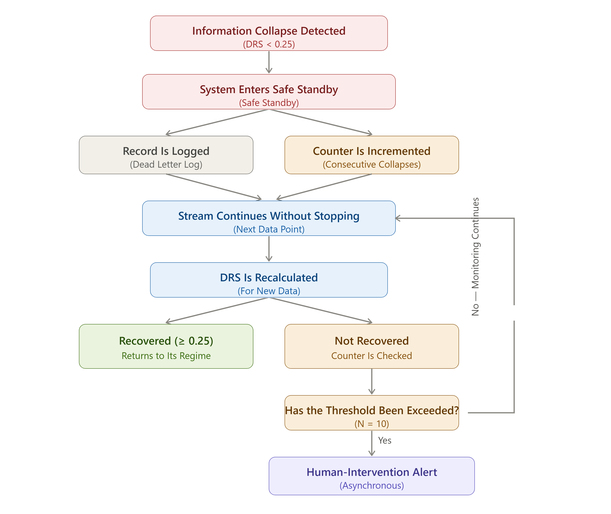

# Abstention Mechanism

## What does this mechanism do?

When the Routing Engine directs data into the Information Collapse regime (DRS < 0.25), the system no longer attempts to produce a prediction. Instead, it deliberately stops and enters **Safe Standby** mode.

This is not a malfunction — it is a safety behavior by design. The data's statistical foundation has weakened to the point that any prediction produced at this stage would be no different from a random outcome rather than genuine information. The system recognizes this and effectively says "I cannot make a safe decision with this data."

## Does the system stop, or does it keep going?

A critical distinction here: **Safe Standby does not mean the entire system halts** — it only means decision-making stops for that specific data record. The system follows these steps:

1. Information Collapse is detected, and the system enters Safe Standby.
2. The corresponding data record is written to a **Dead Letter Log** in JSONL format — including the DRS score, which indicators failed, and a timestamp.
3. At the same time, a **counter** tracking how many consecutive Information Collapse events have occurred is incremented.
4. The system does not stop the stream; it moves on to the next data record.
5. When new data arrives, DRS is automatically recalculated.

In other words, the system never enters a "frozen" waiting state — it continues evaluating new data at all times, simply refraining from producing a decision until a reliable signal is found.

## What happens if the data recovers, and what if it doesn't?

If the DRS score calculated for the new data exceeds the 0.25 threshold, the data automatically returns to its corresponding regime (Clean, Noisy, or Corrupted) and normal operation resumes.

If the threshold is not exceeded, the system checks the counter value. If the counter exceeds a certain threshold (example value: 10 consecutive collapses), the system triggers a human-intervention alert **asynchronously**. Being asynchronous matters here: this alert is not an operation that blocks the main data stream — the system continues processing data while a notification is sent in the background. If the counter threshold has not been exceeded, the system continues monitoring silently; no action is triggered.

The counter threshold (shown as N=10 in the diagram above) is currently an indicative starting value — how many consecutive collapses actually signal a genuine anomaly, for which data environment, will be calibrated as the project progresses.

## Why is the stream never stopped?

An alternative design could have had the system halt the entire stream and wait for human approval the moment Information Collapse occurs. This was not chosen, for the following reasons:

- **A single bad record should not block the entire system.** Information Collapse is often a transient condition (for example, a momentary sensor outage); halting the stream would also delay the processing of the next, healthy data.
- **Human intervention should only be triggered when it's genuinely needed.** The counter mechanism is designed to catch a persistent pattern (N consecutive occurrences), not a one-off collapse. This prevents unnecessary alert fatigue.
- **Logging preserves traceability without stopping anything.** Thanks to the Dead Letter Log, no collapse event is ever lost — even though the system doesn't stop, every event can be reviewed retroactively.

## Next layer

Abstention is a mechanism that activates only within the Information Collapse regime. But the system also carries a separate confidence label attached to **every** output, regardless of regime — this label determines how autonomously an output can be trusted:

→ [Self-Confidence Score (SCS)](en/projects/systems/amplify-core/architecture/self-confidence-score.md)
