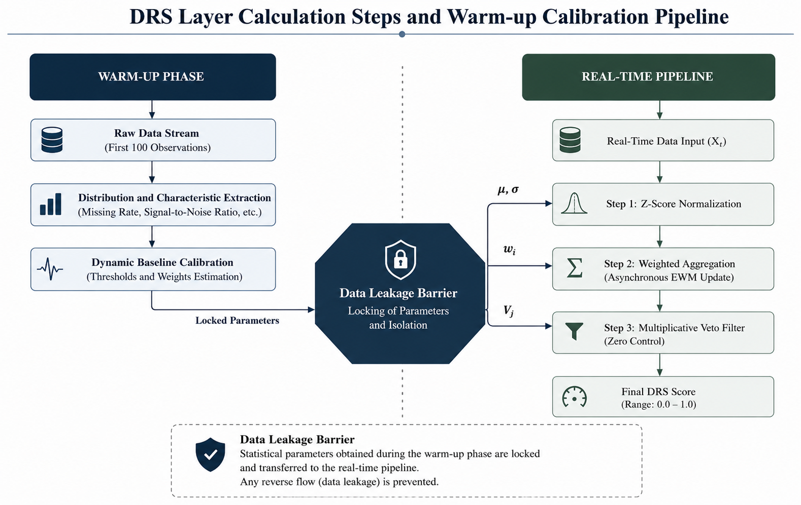

# DRS Layer — Data Reliability Scoring

## What does this layer do?

"Garbage in, garbage out" is the most fundamental problem in data science. Before sending incoming data to any prediction model, the DRS Layer runs it through a "health check" and produces a single number between 0.0 and 1.0: the **Data Reliability Score (DRS)**.

This score lets the system tell the model "trust this data" or "don't trust this data" — the model is never left alone with bad data. The DRS Layer never looks at any prediction model; it only looks at the data's own statistical properties. This is why it is **model-agnostic** — even if the main prediction model changes tomorrow, this layer stays exactly the same.

## Seven indicators — what are we actually measuring?

Seven different angles are continuously measured to determine data reliability. Each one is chosen to catch a different type of degradation:

| Indicator | What it measures | Why it matters |
|---|---|---|
| **Missingness** | Proportion of empty/invalid fields | If missingness is too high, the model starts working off its own assumptions instead of real data |
| **Signal-to-Noise Ratio (SNR)** | Ratio of meaningful signal to noise | Low SNR means the real information in the data has been lost |
| **Temporal Consistency (Autocorrelation)** | Whether consecutive data points support one another | A broken continuity is a sign of malfunction |
| **Outlier Density** | Frequency of values outside the expected range | A single outlier is normal; a cluster of them points to a structural fault |
| **Variance Stability** | Whether volatility changes over time (Levene test) | A sudden variance shift signals a problem at the data source |
| **Information Disorder (Shannon Entropy)** | Amount of "new information" in the data | When entropy approaches maximum, the data has turned into random noise |
| **Drift** | Deviation of the mean from baseline (CUSUM/EWMA) | The data may have silently changed character |

These seven indicators are activated according to a predefined configuration based on data type. For example, in tabular data made up of independent records (like Olist), Autocorrelation is meaningless and gets masked; the remaining six indicators continue operating with their weights re-normalized to sum to 1. In time-series data (UJIIndoorLoc, Yahoo Finance), all seven indicators stay active.

## Calculation flow: from raw data to final score

The diagram below shows the path from the moment data enters the system to the final DRS score, through two parallel processes: on the left, the **Warm-up Phase** where the system learns its own baseline from the first 100 observations; on the right, the **Real-Time Processing Pipeline** that runs for every new data point.

Three stages run in sequence:

1. **Z-Score Normalization** — The seven indicators arrive in different units (SNR in decibels, missingness as a percentage, entropy in bits, etc.). Each is first standardized, then scaled to a [0,1] range. Without this step, unit differences would distort the score.
2. **Weighted Sum** — The seven normalized indicators are multiplied by their weights and summed. Initially, each indicator receives equal weight (1/7 ≈ 14.3%). A mechanism running periodically in the background (the Entropy Weighting Method — EWM) automatically updates the weights based on the indicators' current variance distribution — meaning whichever indicator is "speaking loudest" at that moment gains more influence.
3. **Multiplicative Veto Filter** — This is the system's safety barrier. If any critical indicator (for example, missingness exceeding 50%) crosses into an unacceptable level, the final score is instantly zeroed out — even if every other indicator is perfect. This way, one "well-behaved" indicator can never mask a critical failure.

**Final formula:**

$$DRS = \left( \sum_{i=1}^{7} w'_i \cdot Z_i \right) \times \prod_{j=1}^{7} V_j$$

- $Z_i$: the indicator value normalized via Z-score
- $w'_i$: the weight normalized according to the domain configuration
- $V_j$: the veto value — 0 if the threshold is crossed, 1 otherwise

## Why are the "first 100 observations" special?

When the system first starts, it doesn't yet know the data's normal range — this is the "cold-start" problem. The solution: the first 100 observations are reserved as a **Warm-up Phase**. During this period, the system automatically behaves conservatively (routing to the Fallback Model, producing no autonomous decisions) while it learns the dataset's own statistical baseline.

Once the warm-up phase ends, the learned parameters ($\mu$, $\sigma$, $w_i$) are **frozen** — this is called the **Data Leakage Barrier**. This lock ensures that new data arriving during real-time processing cannot reach back and corrupt the calibration; the system stays both stable and testable.

## Why this design was chosen

- **Why a multiplicative veto instead of a simple average?** In additive scoring systems, one indicator being very high can mask a critical collapse in another (a Simpson's Paradox risk). For example, data with perfect SNR but 90% missingness could still score high under an additive formula. The multiplicative veto prevents this: no indicator can ever cover up another's failure.
- **Why dynamic weighting (EWM) instead of fixed, human-assigned weights?** Rather than setting weights manually or through subjective methods like AHP, a data-driven approach is used — this lets indicators such as Drift in financial data or SNR in IoT data rise to prominence without human intervention.
- **Why is the score capped at 0.75 after stabilization?** Imputation/correction processes can artificially reduce the data's true variance. This cap (`final_drs_score = min(calculated_score, 0.75)`) guarantees that stabilized data can never re-enter the "Clean" regime — meaning the system never over-trusts data it has corrected itself.

---

Once the DRS score is produced, it becomes the input to the **Routing Engine**, which decides which of the four regimes the data belongs to:

→ [Routing Engine](en/projects/systems/amplify-core/architecture/routing-engine.md)
