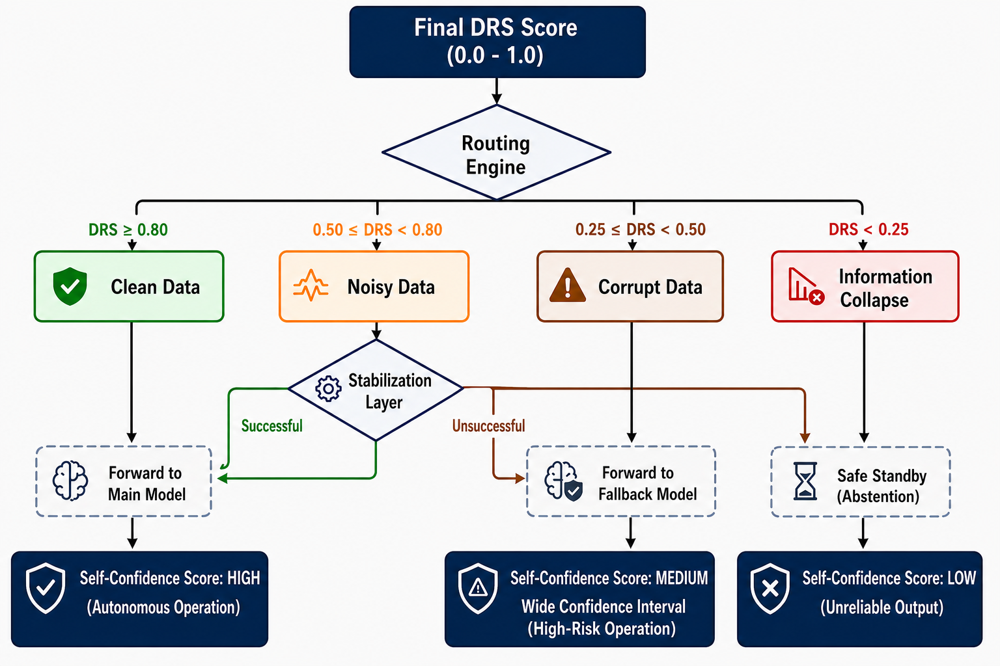

# Routing Engine

## What does this layer do?

The DRS Layer evaluates raw data and produces a single number between 0 and 1. But a number alone is not an action — something has to look at that number and decide "so what do we do now?" That task belongs to the Routing Engine.

The Routing Engine compares the DRS score against predefined threshold values and routes the data into one of four regimes. This decision is **deterministic** — no AI model is trained, no probabilistic prediction is made. The same DRS score always goes to the same regime. This simplicity is a deliberate choice: the system's most critical safety decision is meant to rest on a fixed, auditable rule rather than on a model that itself carries uncertainty.

## Four regimes and threshold values

| Regime | DRS Range | Routed Action |
|---|---|---|
| **Clean** | ≥ 0.80 | The main model produces a prediction directly |
| **Noisy** | 0.50 – 0.79 | The Stabilization Layer is activated |
| **Corrupted** | 0.25 – 0.49 | The Fallback Model is activated |
| **Information Collapse** | < 0.25 | Abstention / Safe Standby |

These four thresholds were not chosen arbitrarily; they are scientifically grounded initial design parameters, consistent with the [0,1] normalization used in data quality classification studies in the literature. They are not fixed — they are calibrated to data type through a systematic threshold sensitivity analysis. But these four ranges clearly define which behavior the system exhibits at which confidence level.

## From regime to regime: how the four actions work

In the **Clean regime**, the data requires no intervention. The main prediction model (regression, XGBoost, or similar) processes the data directly and produces the result. The system follows its fastest and least costly path here.

In the **Noisy regime**, the data is degraded but recoverable. Instead of sending the data directly to the model, the system first routes it to the Stabilization Layer. This layer attempts to improve the data using data-type-specific techniques (rolling median, interpolation, EWMA, etc.), after which the data is sent back to the DRS Layer to be re-scored. If the improvement succeeds, the data moves closer to the Clean regime (though it is never fully considered Clean — the DRS score is capped at 0.75 after stabilization); if it fails, the system downgrades the data to the Corrupted or Information Collapse regime.

In the **Corrupted regime**, the main model can no longer be trusted. In its place, a low-complexity, wide-confidence-interval, conservative Fallback Model takes over. This model does not make sharp, confident predictions; its purpose is simply to provide a reasonable and safe output. If the error rate (RMSE/MAE) of the Fallback Model's prediction exceeds a predefined threshold, the system automatically transitions down to the next regime — Information Collapse.

In the **Information Collapse regime**, the system deliberately stops producing predictions. This is not a failure — it is a safety behavior by design: the data's statistical foundation has weakened to the point that producing any prediction would be no different from a random guess rather than genuine information. At this point, the system enters Abstention mode, logs the data, and continues with the flow.

## Visual flow: four regimes and the dynamic decision loop

The diagram below shows the end-to-end flow starting from the generation of the DRS score, through how the Routing Engine decides among the four regimes, the recovery loop within the Noisy regime, and the final Self-Confidence Score (SCS) labeling.

## Design rationale

**Why fixed thresholds instead of a trainable model?** The routing decision is the system's most critical safety checkpoint. If this decision were also delegated to a machine learning model, the system's knowledge of "when it's safe and when it's not" would itself depend on a predictor carrying its own uncertainty. Fixed, deterministic thresholds break this loop: the routing decision always remains auditable and reproducible.

**Why the Strategy Pattern?** The four regimes are modeled in software as four separate strategies (Clean/Noisy/Corrupted/Collapse). This allows each regime's behavior to be developed, tested, and modified independently — changing one does not break the others.

**Why is data sent back to the DRS Layer in the Noisy regime?** Stabilization is not a one-time operation — it is a loop. Assuming data has "improved" without re-measuring it after the fact would be risky. Re-scoring objectively verifies whether the improvement actually worked.

**Why is the main model completely disabled in the Corrupted regime?** In cases of severe degradation, a "confident-looking" prediction produced by a complex model can actually be a near-random result and create a false sense of trust. A simple, conservative Fallback Model deliberately reduces this risk by providing a less assertive output.

→ [Stabilization Layer](en/projects/systems/amplify-core/architecture/stabilization-layer.md)
