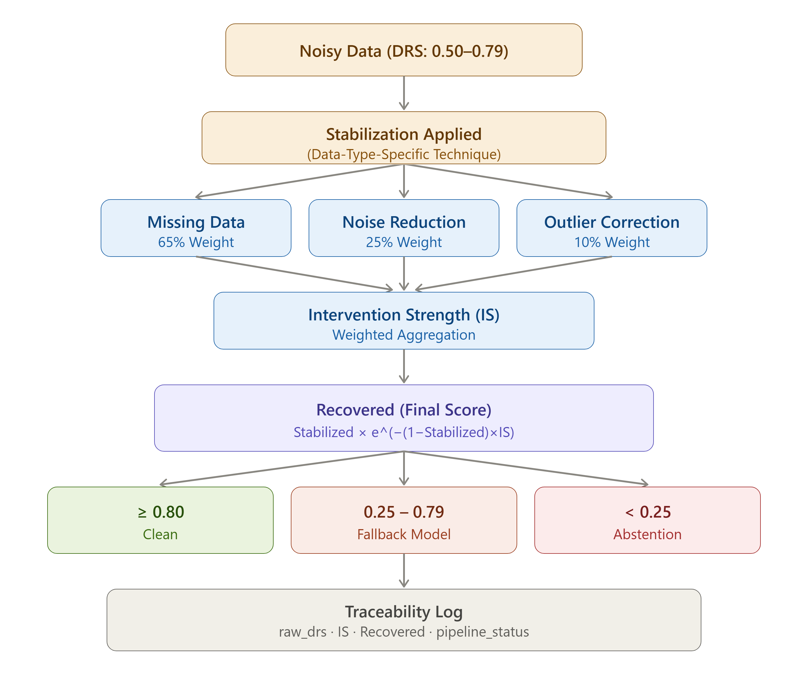

# Stabilization Layer

## What does this layer do?

When the Routing Engine directs data into the Noisy regime (DRS: 0.50–0.79), that data is not lost — it is degraded but recoverable. The Stabilization Layer is a lightweight intermediate layer that attempts to improve this data before sending it on to the model.

The purpose of this layer is not to make the data "perfect." The goal is to bring the data up to a level reliable enough to support a decision. Sometimes this is enough, sometimes it isn't — either way, the system knows exactly what to do next.

## Data-type-specific techniques, fixed decision logic

The technique used for stabilization varies by data type, but regardless of which technique is used, the decision logic (how it's evaluated, which thresholds route it where) always stays the same. This is a direct result of the system's domain-adaptive design:

- **Numerical time-series data:** Rolling median smoothing, CUSUM drift detection
- **Tabular record data:** Linear interpolation, IQR-based winsorizing
- **High-volatility financial data:** EWMA smoothing, non-parametric bootstrap
- **Text-based structured data:** Edit-distance-based denoising, character normalization

This list is not fixed — the system's strength comes not from being tied to specific techniques, but from the fact that the same evaluation logic runs regardless of which technique is used.

## Intervention Strength: how much was touched?

After stabilization is applied, the system needs to know more than just "is the data good now?" — the question "how much was the data touched?" matters just as much. Two pieces of data can end up looking identical on the surface while having undergone very different intensities of intervention: one lightly corrected, another nearly reconstructed from scratch. To capture this distinction, **Intervention Strength (IS)** is calculated: a single value between 0 and 1 representing the total intensity of the intervention applied.

IS is calculated across three operation categories, regardless of which algorithm is used:

| Category | Weight | Why this weight |
|---|---|---|
| **Missing Data Recovery** | 65% | The cell didn't exist in the original data at all — the value is generated from scratch. Highest artificiality. |
| **Noise Reduction** | 25% | The original observation is preserved, only smoothed. Moderate intervention. |
| **Outlier Correction** | 10% | Only a small subset (extreme values) is bounded. Lightest intervention. |

This ranking is not arbitrary: it is based on the degree of artificiality each category introduces into the data. Generating a value from scratch (Missing Data Recovery) is always a more radical intervention than smoothing an existing observation (Noise Reduction); bounding an extreme value to a reasonable range (Outlier Correction) is lighter than both.

Calculation is performed at the category level rather than the algorithm level so that the system does not become dependent on any specific algorithm — the mathematical model stays the same even if a different algorithm performing the same operation is used tomorrow.

## Calculation flow: from Noisy data to final score

The diagram above shows the full path data follows after passing through stabilization. Once stabilization is applied, the weighted combination of the three categories produces the IS value; this value, together with the data's starting quality, feeds into the formula that calculates the final confidence score (**Recovered**):

$$Recovered = Stabilized \times e^{-(1-Stabilized) \times IS}$$

- **Stabilized:** the raw DRS score before stabilization (0.50–0.79 range)
- **IS:** the calculated intervention intensity (0–1 range)

The most important property of this formula: two pieces of data with the same intervention intensity produce different results. Data that started out higher quality (e.g., 0.79) is penalized less, while data that started out weaker (e.g., 0.50) is penalized more heavily — because the penalty coefficient in the formula is derived directly from the data's own raw quality. Two different realities are no longer compressed into the same number.

## Why exponential discounting, not a fixed cap?

In the initial design, the post-stabilization score was capped at a fixed upper limit (0.75). This approach was simple but misleading: data starting at 0.52 and data starting at 0.78 both landed on the same fixed number after successful stabilization — completely ignoring the starting quality and the intensity of the intervention.

Instead, three formula shapes were compared:

- **Linear discounting** was eliminated — under heavy intervention scenarios the score could drop into negative territory, and a negative reliability score is meaningless.
- **Multiplicative discounting** is mathematically safe but exhibits a harsh curve — under very high intervention it can collapse sharply toward zero.
- **Exponential discounting** was chosen because it never drops below zero and exhibits "soft decay" behavior even at high intervention intensities — the score approaches zero gradually rather than hitting a hard cutoff.

## Three possible outcomes

Once the Recovered score is calculated, the data is re-evaluated against the standard regime boundaries:

| Recovered range | Outcome |
|---|---|
| ≥ 0.80 | Moves to the Clean regime, the main model takes over |
| 0.25 – 0.79 | Routed to the Fallback Model |
| < 0.25 | Enters Abstention |

There is a critical design decision here: **if the Recovered score still falls within the gray zone (0.25–0.79), the data is not sent back through the Stabilization Layer again.** This loop is deliberately rejected — because re-stabilizing data that has already been partially synthesized would lead to further synthetic degradation, making the data even more artificial. Instead, the data drops directly to the Fallback Model. If the intervention intensity was very high and the starting quality was low, the Recovered score can fall below the Abstention threshold as well — in which case the system stops producing predictions altogether.

## Traceability: how synthetic is the data behind a decision?

To allow retroactive auditing of how much of the data behind a prediction is real versus stabilization-generated, the following information is attached to every data record:

- **Raw DRS score** — the data's state before stabilization
- **Whether it entered stabilization**
- **Calculated intervention intensity (IS)**
- **Category-level weight distribution**
- **The discount model used**
- **Final Recovered score**
- **Where the data was routed** (main model, fallback model, or abstention)

These records make it possible to trace, after the fact, how much of the data behind any given prediction was synthetic — the system doesn't just produce a decision, it also reports the data foundation that decision was built on.

→ [Abstention Mechanism](en/projects/systems/amplify-core/architecture/abstention-mechanism.md)
