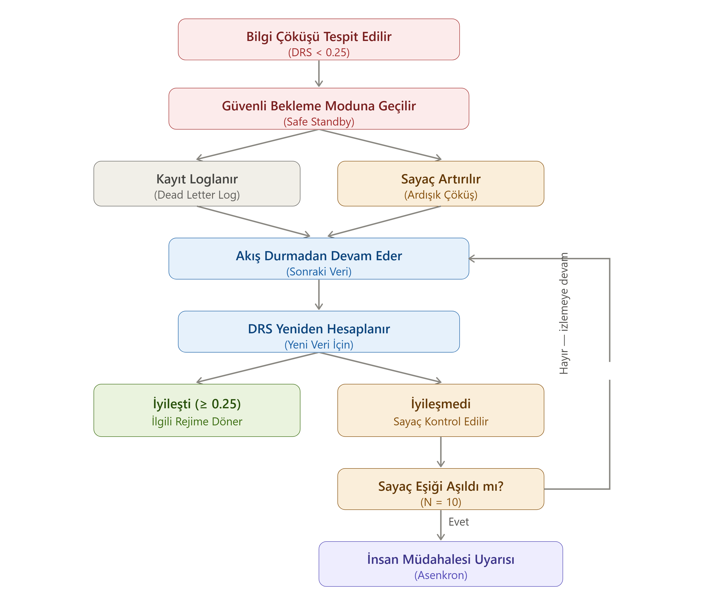

# Karar Kaçınması Mekanizması

## Bu mekanizma ne işe yarar?

Karar Kaçınması (Abstention) mekanizması, sistemin belirsizlik altında yanlış karar vermesini önleyen iki aşamalı bir güvenlik ağıdır. İki farklı noktada tetiklenebilir:

1. **Çıkarım Öncesi (Pre-inference Veto):** Yönlendirme Motoru veriyi Bilgi Çöküşü rejimine (DRS < 0.25) yönlendirdiğinde, hiç bir model çalıştırılmadan doğrudan Güvenli Bekleme moduna geçilir.
2. **Çıkarım Sonrası (Post-inference Veto):** İhtiyatlı Yedek Model tahmin üretse dahi, Post-inference Güven Kapısı ($\tau_{Fallback}$) kontrolünde güven sinyali eşiğin altında kalırsa, sistem tahmini reddeder ve SCS hesaplamasını çalıştırmadan doğrudan Güvenli Bekleme moduna geçer.

Bu bir arıza değil, tasarım gereği bir güvenlik davranışıdır. Verinin istatistiksel temeli veya tahmin güveni zayıfladığında sistem bilinçli olarak "bu veriyle güvenli bir karar veremem" der.

Bu bir arıza değil, tasarım gereği bir güvenlik davranışıdır. Verinin istatistiksel temeli o kadar zayıflamıştır ki, bu noktada üretilecek herhangi bir tahmin gerçek bilgiden çok rastgele bir sonuçtan farksız olur. Sistem bunu bilir ve "bu veriyle güvenli bir karar veremem" der.

## Sistem durur mu, yoksa devam mı eder?

Kritik bir ayrım burada: **Güvenli Bekleme, tüm sistemin durması anlamına gelmez** — sadece o anki veri kaydı için karar üretiminin durması anlamına gelir. Sistem şu adımları izler:

1. Bilgi Çöküşü tespit edilir, Güvenli Bekleme moduna geçilir.
2. İlgili veri kaydı, **işlenemeyen kayıt günlüğüne (Dead Letter Log)** JSONL formatında yazılır — DRS skoru, hangi göstergelerin başarısız olduğu ve zaman damgası birlikte kaydedilir.
3. Aynı anda, ardışık kaç kez Bilgi Çöküşü yaşandığını izleyen bir **sayaç** artırılır.
4. Sistem akışı durdurmaz; bir sonraki veri kaydına geçer.
5. Yeni veri geldiğinde DRS otomatik olarak yeniden hesaplanır.

Yani sistem hiçbir zaman "kilitlenmiş" bir bekleme durumuna girmez — sürekli yeni veriyi değerlendirmeye devam eder, sadece güvenilir bir sinyal bulana kadar karar üretmekten kaçınır.

## İyileşme olursa ne olur, olmazsa ne olur?

Yeni veri için hesaplanan DRS skoru 0.25 eşiğini aşarsa, veri otomatik olarak ilgili rejime (Temiz, Gürültülü veya Bozuk) geri döner ve normal işleyişe devam eder.

Eşik aşılamazsa, sistem sayaç değerini kontrol eder. Sayaç belirli bir eşiği aşarsa (örnek değer: 10 ardışık çöküş), sistem **asenkron olarak** bir insan müdahalesi uyarısı tetikler. "Asenkron" olması önemlidir: bu uyarı, ana veri akışını bloklayan bir işlem değildir — sistem veriyi işlemeye devam ederken arka planda bir bildirim gönderilir. Sayaç eşiği aşılmamışsa, sistem sessizce izlemeye devam eder; hiçbir aksiyon tetiklenmez.

Sayaç eşiği (yukarıdaki diyagramda N=10 olarak gösterilmiştir) şu an için gösterge niteliğinde bir başlangıç değeridir — hangi veri ortamında kaç ardışık çöküşün gerçek bir anomaliye işaret ettiği, proje ilerledikçe veri tipine göre kalibre edilecektir.

## Kaçınma modları: Kayıt bazlı kaçınma ve Sistem bazlı kaçınma (Circuit Breaker)

Amplify Core mimarisinde Karar Kaçınması iki farklı modda kurgulanmıştır:

- **Kayıt Bazlı Kaçınma (Record-Level Abstention — PoC Varsayılanı):** Bozuk veri kaydı loglanarak reddedilir ve sistem durdurulmadan bir sonraki veri kaydına geçilir. Birbirinden bağımsız kayıt akışları için (e-ticaret siparişleri, fatura işleme, finansal veri) en uygun yaklaşımdır.
- **Sistem Bazlı Kaçınma (Circuit Breaker Mode — Gelecek Çalışma Kapsamı):** Ciddi veri bozulmasını tüm sistemin "körleşmesi" olarak yorumlar. Sistem "Halted" (Kilitli) moduna geçer ve insan müdahalesiyle sıfırlanana kadar tüm yeni istekleri blocking yapmadan anında reddeder. Üretim bandı sensörleri ve tıp/dozajlama gibi kritik güvenlik gerektiren endüstriyel ortamlar için tasarlanmıştır.

## Neden Kayıt Bazlı Kaçınmada akış hiç durdurulmuyor?

PoC kapsamında uygulanan Kayıt Bazlı Kaçınma modunda akışın durdurulmama gerekçeleri şunlardır:

- **Tek bir bozuk kayıt, tüm sistemi bloke etmemeli.** Bilgi Çöküşü çoğu zaman geçici bir durumdur (örneğin bir sensörün anlık kesintisi); akışı durdurmak, sonraki sağlıklı verinin de işlenmesini geciktirir.
- **İnsan müdahalesi, ancak gerçekten gerektiğinde tetiklenmeli.** Sayaç mekanizması, tek seferlik bir çöküşü değil, ısrarlı bir örüntüyü (ardışık N kez) yakalamayı hedefler. Bu, gereksiz uyarı yorgunluğunu (alert fatigue) önler.
- **Loglama, durdurmadan da izlenebilirliği sağlar.** Dead Letter Log sayesinde hiçbir çöküş kaybolmaz — sistem durmasa bile, her olay geriye dönük incelenebilir.

## Sonraki katman

Karar Kaçınması, Çıkarım Öncesi (DRS < 0.25) veya Çıkarım Sonrası (Güven Kapısı $\tau$ reddi) durumlarında devreye girerek güvenli duruş sağlar. Kaçınmaya düşmeyip Güven Kapısı'nı başarıyla geçen tüm tahminler için ise nihai otonomi seviyesini belirleyen bir güven etiketi hesaplanır:

→ [Karar Güven Skoru (SCS)](tr/projects/systems/amplify-core/architecture/self-confidence-score.md)
