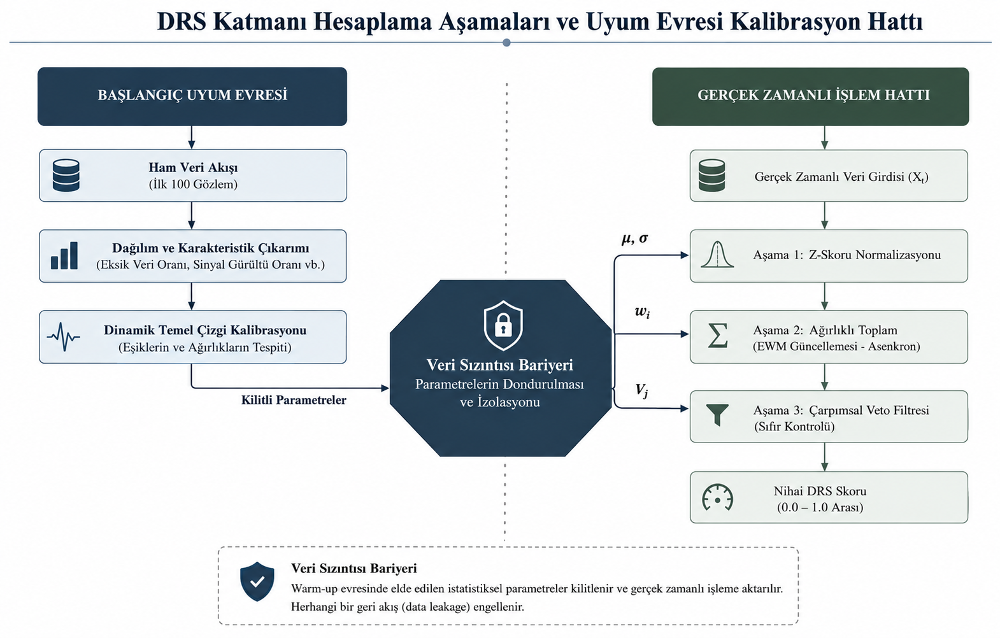

# DRS Katmanı — Veri Güvenilirliği Skorlama

## Bu katman ne işe yarar?

"Çöp girerse, çöp çıkar" (garbage in, garbage out) veri biliminin en temel sorunudur. DRS Katmanı, gelen veriyi herhangi bir tahmin modeline göndermeden önce onun bir "sağlık taraması"ndan geçirir ve 0.0 ile 1.0 arasında tek bir sayı üretir: **Veri Güvenilirliği Skoru (DRS)**.

Bu skor sayesinde sistem, modele "bu veriye güven" ya da "bu veriye güvenme" der — model hiçbir zaman kötü veriyle baş başa bırakılmaz. DRS Katmanı hiçbir tahmin modeline bakmaz; sadece verinin kendi istatistiksel özelliklerine bakar. Bu yüzden **modelden bağımsızdır (model-agnostic)** — yarın ana tahmin modeli değişse bile bu katman aynı kalır.

## Yedi gösterge — verinin neresine bakıyoruz?

Verinin güvenilirliğini belirlemek için yedi farklı açıdan sürekli ölçüm yapılır. Her biri farklı bir bozulma türünü yakalamak için seçilmiştir:

| Gösterge | Ne ölçer | Neden önemli |
|---|---|---|
| **Eksiklik (Missingness)** | Boş/geçersiz alan oranı | Çok yüksek eksiklik varsa model gerçek veriyle değil, kendi tahminiyle çalışmaya başlar |
| **Sinyal-Gürültü Oranı (SNR)** | Anlamlı sinyalin gürültüye oranı | SNR düşükse verideki gerçek bilgi kaybolmuştur |
| **Zamansal Tutarlılık (Otokorelasyon)** | Ardışık verilerin birbirini destekleyip desteklemediği | Süreklilik kopmuşsa bu bir arıza belirtisidir |
| **Aykırı Değer Yoğunluğu** | Beklenen aralık dışındaki verilerin sıklığı | Tekil aykırılık normaldir, yoğunlaşma yapısal bir hatayı gösterir |
| **Varyans İstikrarı** | Oynaklığın zaman içinde değişip değişmediği (Levene testi) | Ani varyans değişimi veri kaynağında bir sorunu işaret eder |
| **Bilgi Düzensizliği (Shannon Entropy)** | Verideki "yeni bilgi" miktarı | Entropi maksimuma çıkarsa veri artık rastgele gürültüye dönüşmüştür |
| **Dağılım Kayması (Drift)** | Ortalamanın baseline'dan uzaklaşması (CUSUM/EWMA) | Veri sessizce karakter değiştirmiş olabilir |

Bu yedi gösterge, veri tipine göre önceden tanımlı bir konfigürasyonla devreye alınır. Örneğin bağımsız kayıtlardan oluşan tablolu veride (Olist gibi) Otokorelasyon anlamsızdır ve maskelenir; kalan altı gösterge ağırlıkları yeniden 1'e normalize edilerek çalışmaya devam eder. Zaman serisi verisinde (UJIIndoorLoc, Yahoo Finance) yedi göstergenin tamamı aktiftir.

## Hesaplama akışı: ham veriden nihai skora

Aşağıdaki diyagram, verinin sisteme ilk girdiği andan nihai DRS skoruna kadar geçen yolu iki paralel süreçle gösteriyor: sol tarafta sistemin ilk 100 gözlemle kendi normalini öğrendiği **Başlangıç Uyum Evresi**, sağ tarafta ise her yeni veri için çalışan **Gerçek Zamanlı İşlem Hattı**.

Üç aşama sırayla işler:

1. **Z-Skoru Normalizasyonu** — Yedi gösterge farklı birimlerde gelir (SNR desibel, eksiklik yüzde, entropi bit vb.). Her biri önce standartlaştırılır, sonra [0,1] aralığına çekilir. Bu adım olmadan birim farkları skoru yanıltır.
2. **Ağırlıklı Toplam** — Normalize edilmiş yedi gösterge, ağırlıklarıyla çarpılıp toplanır. Başlangıçta her göstergeye eşit ağırlık verilir (1/7 ≈ %14.3). Arka planda periyodik olarak çalışan bir mekanizma (Entropi Ağırlıklandırma Yöntemi — EWM), ağırlıkları göstergelerin güncel varyans dağılımına göre otomatik günceller — yani hangi göstergenin o an daha "konuşkan" olduğuna göre önem kazanır.
3. **Çarpımsal Veto Filtresi** — Bu, sistemin güvenlik bariyeridir. Eğer kritik bir gösterge (örneğin eksiklik oranı %50'yi aşarsa) kabul edilemez bir seviyeye gelirse, diğer tüm göstergeler mükemmel olsa bile nihai skor anında sıfırlanır. Böylece "iyi giden" bir gösterge, kritik bir arızayı maskeleyemez.

**Nihai formül:**

$$DRS = \left( \sum_{i=1}^{7} w'_i \cdot Z_i \right) \times \prod_{j=1}^{7} V_j$$

- $Z_i$: Z-skoru ile normalize edilmiş gösterge değeri
- $w'_i$: Domain konfigürasyonuna göre normalize edilmiş ağırlık
- $V_j$: Veto değeri — eşik aşılırsa 0, aksi halde 1

## Neden "ilk 100 gözlem" özel?

Sistem ilk çalıştığında verinin normal aralığını henüz bilmez — bu "soğuk başlangıç" (cold-start) problemidir. Çözüm: ilk 100 gözlem bir **Başlangıç Uyum Evresi (Warm-up)** olarak ayrılır. Bu süre boyunca sistem otomatik olarak temkinli davranır (Yedek Modele yönlendirir, otonom karar üretmez) ve veri setinin kendi istatistiksel normalini öğrenir.

Uyum evresi bitince öğrenilen parametreler ($\mu$, $\sigma$, $w_i$) **kilitlenir (freeze)** — buna **Veri Sızıntısı Bariyeri** denir. Bu kilit sayesinde gerçek zamanlı işlem sırasında gelen yeni veri, geçmişe dönüp kalibrasyonu bozamaz; sistem hem kararlı hem de test edilebilir kalır.

## Neden bu tasarım tercih edildi

- **Neden basit ortalama değil de çarpımsal veto?** Toplamsal (additive) sistemlerde bir gösterge çok yüksek çıkarsa, başka bir göstergedeki kritik çöküşü maskeleyebilir (Simpson Paradoksu riski). Örneğin SNR mükemmel ama eksiklik %90 olan veri, toplamsal formülde yüksek skor alabilir. Çarpımsal veto bunu önler: hiçbir gösterge diğerinin arızasını örtemez.
- **Neden dinamik ağırlıklandırma (EWM) ve insan tarafından belirlenen sabit ağırlıklar değil?** Ağırlıkları elle/AHP gibi öznel yöntemlerle belirlemek yerine, veri-güdümlü bir yaklaşım kullanılıyor — bu sayede finansal veride Drift, IoT verisinde SNR gibi göstergeler insan müdahalesi olmadan öne çıkabiliyor.
- **Neden stabilizasyon sonrası skor 0.75 ile sınırlı?** Doldurma/düzeltme (imputation) işlemleri verinin gerçek varyansını yapay olarak düşürebilir. Bu sınır (`final_drs_score = min(calculated_score, 0.75)`), iyileştirilmiş verinin asla "Temiz" rejimine giremeyeceğini garanti eder — yani sistem kendi düzelttiği veriye gereğinden fazla güvenmez.

---

DRS skoru üretildikten sonra bu skor **Yönlendirme Motoru**'na girdi olur ve dört rejimden birine karar verilir:

→ [Yönlendirme Motoru](tr/projects/systems/amplify-core/architecture/routing-engine.md)
