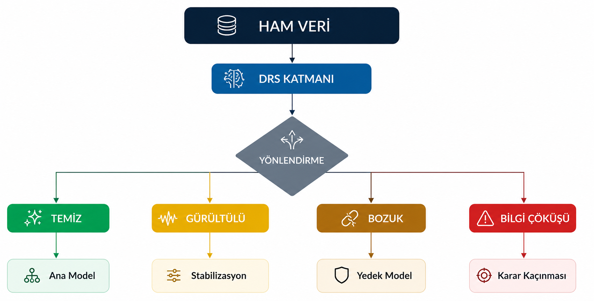

# Genel Sistem Mimarisi
 
## Bu sistem ne yapıyor?

Amplify Core, bir tahmin modeli değil — tahmin modelinin **önünde duran bir güvenlik katmanı**dır. Amacı şu soruyu, herhangi bir makine öğrenmesi modeli devreye girmeden önce sormaktır:

> "Elimdeki bu veriyle güvenilir bir karar üretebilir miyim?"

Gerçek dünyada veri nadiren mükemmel gelir: sensör düşebilir, ağ kesilebilir, kayıtlar eksik veya çelişkili olabilir. Çoğu sistem buna rağmen bir çıktı üretmeye zorlanır — bu da "sahte kesinlik" (false confidence) riskini doğurur: sistem emin görünür ama yanılıyordur. Amplify Core bunun yerine veriyi önce değerlendirir, sonra dört farklı yoldan birine yönlendirir.

## Dört rejim, dört farklı davranış

Yukarıdaki diyagram sistemin uçtan uca akışını gösteriyor. Ham veri önce **DRS Katmanı**'ndan geçer (Data Reliability Score — Veri Güvenilirliği Skoru), 0 ile 1 arasında tek bir sayı üretir. **Yönlendirme Motoru** bu skora bakıp veriyi dört rejimden birine yönlendirir:

| Rejim | DRS aralığı | Ne olur |
|---|---|---|
| **Temiz** | ≥ 0.80 | Veri güvenilir, ana model doğrudan tahmin üretir |
| **Gürültülü** | 0.50 – 0.79 | Veride düzeltilebilir bozulma var, Stabilizasyon Katmanı devreye girip veriyi iyileştirir, sonra tekrar değerlendirilir |
| **Bozuk** | 0.25 – 0.49 | Bozulma ciddi, ana model devre dışı bırakılır; daha basit ve temkinli bir Yedek Model kullanılır |
| **Bilgi Çöküşü** | < 0.25 | Veri artık güvenilir bir karar üretmeye yetecek istatistiksel bilgi taşımıyor; sistem tahmin üretmeyi bilinçli olarak durdurur (Karar Kaçınması / Güvenli Bekleme) |

Kritik nokta: son satır bir hata değil, tasarım kararı. Sistem "bilmiyorum" diyebilme yetisine sahip — çünkü bazı durumlarda yanlış bir tahmin üretmek, hiç tahmin üretmemekten daha maliyetlidir (örnek: yanlış teşhis, yanlış finansal işlem, yanlış üretim kararı).

## Neden bu mimari önemli — kısaca

- **Model bağımsız (model-agnostic):** DRS Katmanı ve Yönlendirme Motoru, arkada hangi tahmin modeli çalışırsa çalışsın (regresyon, XGBoost, basit kural motoru) aynı mantıkla işler. Modeli değiştirmek bu iki katmanı etkilemez.
- **Veri tipine uyumlu (domain-adaptive):** Stabilizasyon Katmanı içindeki teknikler veri tipine göre değişir (sayısal zaman serisi, tablolu veri, finansal veri, metin) — ama karar mantığı (DRS eşikleri, dört rejim) her zaman aynı kalır.
- **Şeffaf:** Her karar, hangi göstergenin (missingness, gürültü oranı, vb.) eşiği aştığı bilgisiyle birlikte raporlanır — kara kutu değil.

## Mühendisler için: bileşenlerin teknik rolü

1. **DRS Katmanı** — yedi istatistiksel gösterge (eksiklik oranı, sinyal-gürültü oranı, otokorelasyon, aykırı değer yoğunluğu, varyans istikrarı, Shannon entropisi, drift) üzerinden ağırlıklı ve çarpımsal-veto mekanizmalı tek bir skor üretir. Modelden bağımsızdır; sadece ham verinin istatistiksel özelliklerine bakar. *(Detaylı formülasyon: [DRS Katmanı](drs-layer.md))*
2. **Yönlendirme Motoru** — DRS skorunu eşiklerle karşılaştırıp deterministik (eğitim gerektirmeyen) bir yönlendirme kararı verir. Strategy pattern ile implemente edilir.
3. **Stabilizasyon Katmanı** — sadece Gürültülü rejimde aktif olur. Veri tipine özgü teknikler kullanır (rolling median + CUSUM, interpolation + winsorizing, EWMA + bootstrap, edit-distance denoising). Stabilizasyon sonrası DRS skoru en fazla 0.75'e çıkabilir (imputation penalty) — yani stabilize edilmiş veri hiçbir zaman "Temiz" rejimine giremez.
4. **Yedek Model (Fallback)** — Bozuk rejimde çalışan, düşük karmaşıklıklı, geniş güven aralıklı, temkinli bir tahminci.
5. **Karar Kaçınması / Güvenli Bekleme (Abstention)** — Bilgi Çöküşü rejiminde devreye girer; veriyi loglar, sistemi durdurmadan bir sonraki veriye geçer, art arda çok sayıda çöküş yaşanırsa insan müdahalesi uyarısı tetikler.

## İki farklı diyagram, iki farklı seviye

Bu sayfadaki diyagram sistemin **makro akışını** gösteriyor — "veri nereden nereye gidiyor". DRS Katmanı'nın **iç matematiğini** (Z-skoru normalizasyonu, ağırlıklandırma, çarpımsal veto, nihai skor hesaplama) görmek için bir sonraki sayfaya geçin:

→ [DRS Katmanı — Veri Güvenilirliği Skorlama](drs-layer.md)
