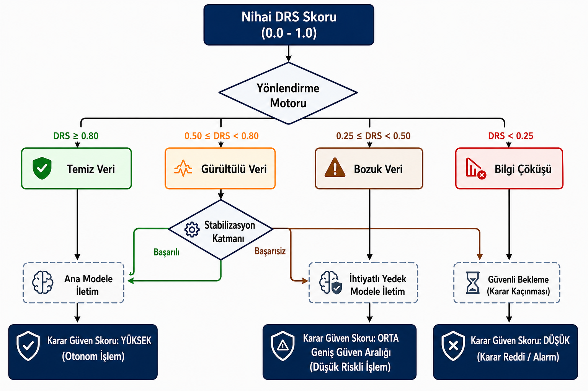

# Yönlendirme Motoru

## Bu katman ne işe yarar?

DRS Katmanı ham veriyi değerlendirip 0 ile 1 arasında tek bir sayı üretir. Ama bir sayı tek başına bir aksiyon değildir — birinin bu sayıya bakıp "peki şimdi ne yapacağız?" sorusuna karar vermesi gerekir. Bu görev Yönlendirme Motoru'na aittir.

Yönlendirme Motoru, DRS skorunu önceden belirlenmiş eşik değerleriyle karşılaştırır ve veriyi dört rejimden birine yönlendirir. Bu karar **deterministiktir** — yani hiçbir yapay zeka modeli eğitilmez, hiçbir olasılıksal tahmin yapılmaz. Aynı DRS skoru her zaman aynı rejime gider. Bu basitlik bilinçli bir tercihtir: sistemin en kritik güvenlik kararının, kendisi de belirsizlik taşıyan bir modele değil, sabit ve denetlenebilir bir kurala dayanması istenir.

## Dört rejim ve eşik değerleri

| Rejim | DRS Aralığı | Yönlendirilen Aksiyon |
|---|---|---|
| **Temiz (Clean)** | ≥ 0.80 | Ana model doğrudan tahmin üretir |
| **Gürültülü (Noisy)** | 0.50 – 0.79 | Stabilizasyon Katmanı devreye girer |
| **Bozuk (Corrupted)** | 0.25 – 0.49 | Yedek Model (Fallback) devreye girer |
| **Bilgi Çöküşü (Information Collapse)** | < 0.25 | Karar Kaçınması / Güvenli Bekleme |

Bu dört eşik rastgele seçilmemiştir; literatürdeki veri kalitesi sınıflandırma çalışmalarının [0,1] normalizasyonuyla uyumlu, bilimsel gerekçeli başlangıç tasarım parametreleridir. Sabit değildirler — sistematik bir eşik duyarlılık analiziyle veri tipine göre kalibre edilirler. Ama bu dört aralık, sistemin hangi güven seviyesinde hangi davranışı sergileyeceğini net biçimde tanımlar.

## Rejimden rejime: dört aksiyon nasıl çalışır

**Temiz rejimde** veri hiçbir müdahaleye ihtiyaç duymaz. Ana tahmin modeli (regresyon, XGBoost veya benzeri) veriyi doğrudan işler ve sonucu üretir. Sistem burada en hızlı ve en az maliyetli yolu izler.

**Gürültülü rejimde** veri bozulmuş ama kurtarılabilir durumdadır. Sistem veriyi doğrudan modele göndermek yerine önce Stabilizasyon Katmanı'na yönlendirir. Bu katman veri tipine özgü tekniklerle (rolling median, interpolation, EWMA vb.) veriyi iyileştirmeye çalışır, ardından veri DRS Katmanı'na geri gönderilip yeniden skorlanır. İyileşme başarılıysa veri Temiz rejime yaklaşır (ama asla tam olarak Temiz sayılmaz — stabilizasyon sonrası DRS skoru 0.75 ile sınırlıdır); başarısızsa sistem veriyi Bozuk veya Bilgi Çöküşü rejimine düşürür.

**Bozuk rejimde** artık ana modele güvenilmez. Onun yerine düşük karmaşıklıklı, geniş güven aralıklı, temkinli bir Yedek Model (Fallback Model) devreye girer. Bu model kesin ve iddialı tahminler yapmaz; amacı sadece makul ve güvenli bir çıktı vermektir. Eğer Yedek Modelin ürettiği tahminin hata oranı (RMSE/MAE) önceden belirlenmiş bir eşiği aşarsa, sistem otomatik olarak bir alt rejime — Bilgi Çöküşü'ne — geçer.

**Bilgi Çöküşü rejiminde** sistem tahmin üretmeyi bilinçli olarak durdurur. Bu bir hata değil, tasarım gereği bir güvenlik davranışıdır: verinin istatistiksel temeli o kadar zayıflamıştır ki, herhangi bir tahmin üretmek gerçek bilgiden çok rastgele bir tahminden farksız hâle gelir. Sistem bu noktada Karar Kaçınması moduna geçer, veriyi kaydeder ve akışa devam eder.

## Görsel akış: dört rejim ve dinamik karar döngüsü

Aşağıdaki diyagram, DRS skorunun üretilmesinden itibaren Yönlendirme Motoru'nun dört rejim arasında nasıl karar verdiğini, Gürültülü rejimdeki kurtarma döngüsünü ve nihai Karar Güven Skoru (SCS) etiketlemesine kadar uzanan uçtan uca akışı gösterir.

## Tasarım gerekçeleri

**Neden eğitilebilir bir model değil de sabit eşikler?** Yönlendirme kararı sistemin en kritik güvenlik noktasıdır. Bu karar bir makine öğrenmesi modeline bırakılsaydı, sistemin "ne zaman güvenli, ne zaman değil" bilgisi kendisi de belirsizlik taşıyan bir tahminciye bağlı kalırdı. Sabit, deterministik eşikler bu döngüyü kırar: yönlendirme kararı her zaman denetlenebilir ve tekrarlanabilir kalır.

**Neden Strategy Pattern?** Dört rejim, yazılım tarafında dört ayrı strateji (Temiz/Gürültülü/Bozuk/Çöküş) olarak modellenir. Böylece her rejimin davranışı bağımsız olarak geliştirilebilir, test edilebilir ve gerektiğinde değiştirilebilir — birini değiştirmek diğerlerini bozmaz.

**Neden Gürültülü rejimde veri tekrar DRS'ye gönderiliyor?** Stabilizasyon bir kerelik bir işlem değil, bir döngüdür. Veri iyileştirildikten sonra tekrar ölçülmeden "iyileşti" varsaymak riskli olurdu. Yeniden skorlama, iyileştirmenin gerçekten işe yarayıp yaramadığını nesnel biçimde doğrular.

**Neden Bozuk rejimde ana model tamamen devre dışı?** Ciddi bozulma durumunda karmaşık bir modelin ürettiği "kesin görünen" bir tahmin, aslında rastgele bir sonuç olabilir ve yanlış bir güven duygusu yaratır. Basit ve temkinli bir Yedek Model, bilinçli olarak daha az iddialı bir çıktı vererek bu riski azaltır.

→ [Stabilizasyon Katmanı](tr/projects/systems/amplify-core/architecture/stabilization-layer.md)
