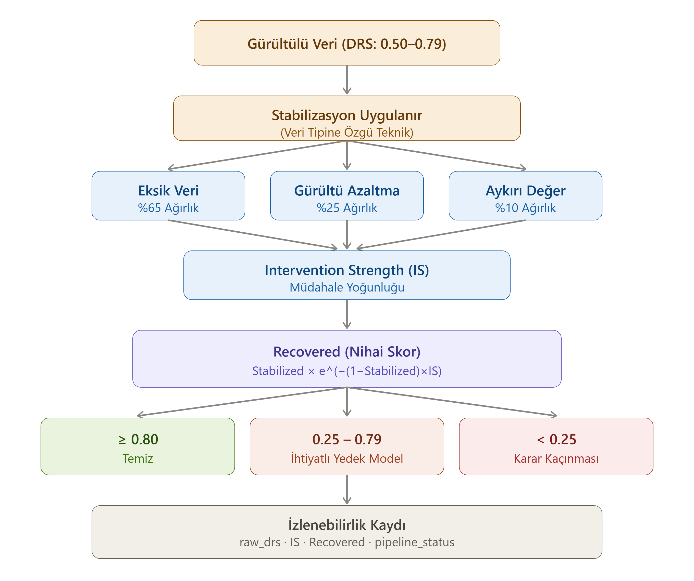

# Stabilizasyon Katmanı

## Bu katman ne işe yarar?

Yönlendirme Motoru bir veriyi Gürültülü rejime (DRS: 0.50–0.79) yönlendirdiğinde, bu veri kaybedilmiş değildir — sadece bozulmuş ama kurtarılabilir durumdadır. Stabilizasyon Katmanı, bu veriyi doğrudan modele göndermeden önce iyileştirmeye çalışan hafif bir ara katmandır.

Bu katmanın amacı veriyi "mükemmel hale getirmek" değildir. Amaç, veriyi karar üretecek kadar güvenilir bir seviyeye taşımaktır. Bazen bu yeterli olur, bazen olmaz — her iki durumda da sistem bir sonraki adımda ne yapacağını net biçimde bilir.

## Veri tipine özgü teknikler, sabit karar mantığı

Stabilizasyon için kullanılan teknik yöntem veri tipine göre değişir, ama hangi tekniğin kullanıldığından bağımsız olarak karar mantığı (nasıl değerlendirileceği, hangi eşiklere göre yönlendirileceği) her zaman aynı kalır. Bu, sistemin domain-adaptive (veri alanına uyumlu) tasarımının doğrudan sonucudur:

- **Sayısal zaman serisi verisi:** Hareketli medyan düzleştirme (rolling median smoothing), CUSUM veri kayması tespiti
- **Tablolu kayıt verisi:** Doğrusal interpolasyon, IQR tabanlı winsorizing
- **Yüksek volatiliteli finansal veri:** EWMA düzleştirme, parametrik olmayan bootstrap
- **Metin tabanlı yapılandırılmış veri:** Düzenleme mesafesi tabanlı gürültü giderme (edit-distance denoising), karakter normalizasyonu

Bu liste sabit değildir — sistemin gücü belirli tekniklere bağlı olmasından değil, hangi teknik kullanılırsa kullanılsın aynı değerlendirme mantığının çalışmasından gelir.

## Müdahale Yoğunluğu: ne kadar dokunuldu?

Stabilizasyon uygulandıktan sonra sistemin bilmesi gereken tek şey "veri artık iyi mi?" değildir — "veriye ne kadar dokunuldu?" sorusu da aynı derecede önemlidir. Çünkü aynı nihai görünüme sahip iki veri, farklı yoğunlukta müdahale görmüş olabilir; biri hafifçe düzeltilmiş, diğeri neredeyse yeniden inşa edilmiş olabilir. Bu ayrımı yakalamak için **Intervention Strength (Müdahale Yoğunluğu — IS)** hesaplanır: 0 ile 1 arasında, uygulanan müdahalenin toplam yoğunluğunu temsil eden tek bir değer.

IS, hangi algoritmanın kullanıldığına bakılmaksızın üç işlem kategorisi üzerinden hesaplanır:

| Kategori | Ağırlık | Neden bu ağırlık |
|---|---|---|
| **Eksik Veri Tamamlama** | %65 | Hücre orijinalde hiç yok — değer sıfırdan üretiliyor. En yüksek yapaylık. |
| **Gürültü Azaltma** | %25 | Orijinal gözlem korunuyor, sadece yumuşatılıyor. Orta düzey müdahale. |
| **Aykırı Değer Düzeltme** | %10 | Sadece küçük bir alt küme (uç değerler) sınırlanıyor. En düşük müdahale. |

Bu sıralama rastgele değildir: bir kategorinin veriye kattığı yapaylık derecesine göre belirlenmiştir. Sıfırdan veri üretmek (Eksik Veri Tamamlama), mevcut bir gözlemi yumuşatmaktan (Gürültü Azaltma) her zaman daha radikal bir müdahaledir; bir uç değeri makul bir aralığa çekmek (Aykırı Değer Düzeltme) ise ikisinden de daha hafiftir.

Algoritma bazında değil kategori bazında hesaplama yapılmasının nedeni, sistemin belirli bir algoritmaya bağımlı kalmamasıdır — yarın aynı işlemi yapan farklı bir algoritma kullanılsa bile matematiksel model değişmez.

## Hesaplama akışı: Gürültülü veriden nihai skora

Yukarıdaki diyagram, verinin stabilizasyondan geçtikten sonra izlediği tam yolu gösteriyor. Stabilizasyon uygulandıktan sonra üç kategorinin ağırlıklı ortalaması IS değerini üretir; bu değer, verinin başlangıç kalitesiyle birlikte nihai güven skorunu (**Recovered**) hesaplayan formüle girdi olur:

$$Recovered = Stabilized \times e^{-(1-Stabilized) \times IS}$$

- **Stabilized:** stabilizasyon öncesi ham DRS skoru (0.50–0.79 aralığı)
- **IS:** hesaplanan müdahale yoğunluğu (0–1 aralığı)

Bu formülün en önemli özelliği: aynı müdahale yoğunluğuna sahip iki veri, farklı sonuçlar üretir. Başlangıçta kaliteli olan veri (örneğin 0.79) daha az cezalandırılır, başlangıçta zayıf olan veri (örneğin 0.50) daha ağır cezalandırılır — çünkü formüldeki ceza katsayısı doğrudan verinin kendi ham kalitesinden türetilir. İki farklı gerçeklik artık aynı sayıya sıkıştırılmaz.

## Neden üstel indirim, neden sabit bir tavan değil?

İlk tasarımda stabilizasyon sonrası skor sabit bir üst sınırla (0.75) sınırlandırılıyordu. Bu yaklaşım basit ama yanıltıcıydı: 0.52'den gelen bir veri ile 0.78'den gelen bir veri, başarılı bir stabilizasyon sonrasında aynı sabit sayıya iniyordu — başlangıç kalitesi ve müdahale yoğunluğu tamamen göz ardı ediliyordu.

Bunun yerine üç formül şekli karşılaştırıldı:

- **Doğrusal indirim** elendi — ağır müdahale senaryolarında skor negatife düşebiliyor, ki bir güvenilirlik skorunun negatif olması anlamsızdır.
- **Çarpımsal indirim** matematiksel olarak güvenli ama sert bir eğri sergiliyor — çok yüksek müdahalede skor sıfıra yakın sert bir kesintiye uğrayabiliyor.
- **Üstel indirim** seçildi çünkü hem asla negatife düşmüyor hem de yüksek müdahale yoğunluğunda bile "yumuşak bozunma" (soft decay) davranışı gösteriyor — skor sıfıra doğru kademeli olarak yaklaşır, sert bir kesintiyle çakılmaz.

## Üç olası çıkış

Recovered skoru hesaplandıktan sonra, veri normal rejim sınırlarına göre yeniden değerlendirilir:

| Recovered aralığı | Sonuç |
|---|---|
| ≥ 0.80 | Temiz rejimine geçer, ana model devreye girer |
| 0.25 – 0.79 | İhtiyatlı Yedek Modele yönlendirilir |
| < 0.25 | Karar Kaçınması moduna geçilir |

Burada kritik bir tasarım kararı var: **eğer Recovered skoru hâlâ gri bölgede (0.25–0.79) kalıyorsa, veri tekrar Stabilizasyon Katmanına gönderilmez.** Bu döngü bilinçli olarak reddedilmiştir — çünkü kısmen yapay hale gelmiş bir veriyi tekrar stabilizasyona sokmak, veriyi daha da yapaylaştıran bir sentetik yozlaşmaya yol açar. Bunun yerine veri doğrudan İhtiyatlı Yedek Modele düşer. Eğer müdahale yoğunluğu çok yüksekse ve başlangıç kalitesi düşükse, Recovered skoru Karar Kaçınması eşiğinin de altına inebilir — bu durumda sistem doğrudan tahmin üretmeyi durdurur.

## İzlenebilirlik: hangi veri ne kadar sentetik?

Bir tahminin arkasındaki verinin ne kadarının gerçek, ne kadarının stabilizasyonla üretilmiş olduğunu sonradan denetleyebilmek için her veri kaydına şu bilgiler eklenir:

- **Ham DRS skoru** — verinin stabilizasyon öncesi durumu
- **Stabilizasyona girip girmediği**
- **Hesaplanan müdahale yoğunluğu (IS)**
- **Kategori bazlı ağırlık dağılımı**
- **Kullanılan ceza modeli**
- **Nihai Recovered skoru**
- **Verinin nereye yönlendirildiği** (ana model, yedek model veya karar kaçınması)

Bu kayıtlar, bir tahminde kullanılan verinin ne ölçüde sentetik olduğunun geriye dönük olarak izlenebilmesini sağlar — sistem sadece bir karar üretmekle kalmaz, o kararın hangi veri temelinde üretildiğini de raporlar.

→ [Karar Kaçınması Mekanizması](tr/projects/systems/amplify-core/architecture/abstention-mechanism.md)
